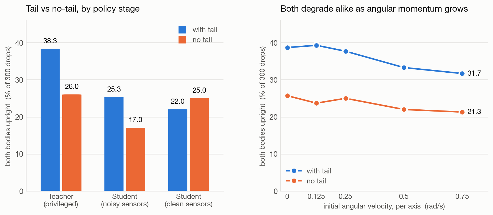

# Tail-ablation evaluation

> **Superseded for absolute numbers (2026-07-31).** Everything below was measured
> against the pre-retune environment. Three changes since then move every cell:
> the five-term reward was retuned from scratch (`docs/REWARD_TUNING.md`), motor
> parameters are now randomized per motor *group* rather than per joint, initial
> joint angles are randomized, and `model/cat.xml` had a 10x pitch-armature typo
> (0.03 vs the 0.003 in `cat_notail.xml` for the same motor) that made the two
> ablation arms run different pitch dynamics. **The tail-vs-no-tail comparison
> below was therefore partly confounded and should be re-run before it is cited.**
> Current numbers are in the next section; the analysis of *why* `w_sm` collapses a
> weak variant remains correct and was reproduced three more times during retuning.

## Current numbers (2026-07-31, retuned reward)

500 random drops, seed 0, both bodies under 30° of tilt. Sampling SE ≈2.2 pp;
training-run-to-run spread is larger, about ±5 pp (see `docs/REWARD_TUNING.md`).

| Configuration | With tail | No tail | previously |
|---|---:|---:|---|
| Teacher (privileged obs) | **62.8%** | **34.0%** | 38.3% / 26.0% |
| Student, noisy sensors | **47.2%** | **28.8%** | 25.3% / 17.0% |
| Student, clean sensors | **47.0%** | **27.6%** | 22.0% / 25.0% |

Median final tilt, students: 27°/28° (tail), 41°/38° (no tail).
`hardware/e2e_test.py` closed-loop: **45/100 tail** (was 29–30), **32/100 no tail**
(was 12–25). Both variants pass 5/5 pipeline checks.

The teacher also got substantially calmer, which is the point of the new terms —
shipped tail teacher vs the same teacher trained with no penalties at all:

| | penalty-free | shipped | change |
|---|---:|---:|---:|
| success | 57.8% | 62.8% | +5.0 pp |
| mean tilt | 27° | 25° | −2° |
| action rate `m_sm` | 0.237 | 0.089 | **−62%** |
| joint travel, roll (rad) | 8.2 | 5.9 | **−28%** |
| final \|omega\| (rad/s) | 4.11 | 2.48 | **−40%** |
| \|action\| roll/pitch/tail | 0.76/0.66/0.76 | 0.51/0.48/0.67 | — |

Success is within the ±5 pp run-to-run noise band (`combo_cool` scored 55.0 / 62.8 /
50.4% over three seeds against a 57.8% baseline), so the honest claim is **equal
success at roughly half the motion**, not a success improvement.

The tail arm runs the full penalty budget; the no-tail arm runs a quarter of it
(`notail_penalty_scale`), because it collapses to passivity at the tailed weights.
That difference is itself a finding — see the no-tail section of the tuning doc —
but it means the two arms are no longer reward-identical, so the gap above mixes the
tail's physical contribution with a reward-budget difference. Re-running the ablation
cleanly (both arms at the same budget, at whatever budget the weaker one tolerates)
is the open item.

---

# Original study (pre-retune)

Measured 2026-07-30 with `w_sm = 0.5`. All numbers come from `docs/evaluate.py` —
300 random drops per configuration, seed 0, counting a drop as a success when
**both** bodies finish under 30° of tilt. Sampling SE is ≈2.5 pp per cell, so the SE
on a tail-vs-no-tail difference is ≈3.5 pp.



## Headline

| Configuration | With tail | No tail | Gap | Significant? |
|---|---:|---:|---:|---|
| Teacher (privileged obs) | **38.3%** | **26.0%** | 12.3 pp | yes, 3.3 SE |
| Student, noisy sensors | 25.3% | 17.0% | 8.3 pp | yes, 2.5 SE |
| Student, clean sensors | 22.0% | 25.0% | −3.0 pp | no, 0.9 SE |

Median final tilt: **28°/25° with tail, 36°/36° without** (teacher).

**The tail helps, but modestly.** The privileged teacher gains ~12 pp and the
noisy-sensor student ~8 pp. On clean sensors the two are indistinguishable. This is a
much smaller effect than the first round of this experiment reported, for the reason
in the next section.

## Correction: the first result was a reward-shaping artifact

An earlier version of this document reported **45.3% vs 5.0%** — a 40 pp gap — and
concluded the tail effect was "large and unambiguous." That was wrong, and the cause
was `w_sm`, the action-smoothness penalty, previously set to **2.0** (twice `w_pos`).

At that weight a variant that cannot *reliably* right itself scores better holding
still than trying: passively drifting earns `r_pos` ≈ 1.2 at zero smoothness cost,
while a vigorous failed attempt pays the penalty and earns little more. The no-tail
policy took that deal and converged to doing nothing. Measured on the no-tail teacher
at 300k steps:

| `w_sm` | success | mean final tilt | mean \|action\| roll / pitch |
|---|---:|---:|---:|
| 2.0 | 5.7% | 90° (= random orientation) | 0.075 / 0.083 |
| 0.5 | 13.7% | 53° | 0.800 / 0.782 |
| 0.1 | 16.0% | 51° | 0.746 / 0.800 |

The symptom that exposed it: **the pitch joint barely moved.** Joint travel per
episode, teacher policies:

| | rot1 (roll) | pitch |
|---|---:|---:|
| tail, `w_sm` 2.0 | 3.96 rad | 1.22 rad |
| no-tail, `w_sm` 2.0 | 0.53 rad | **0.10 rad** |
| no-tail, `w_sm` 0.5 | 5.64 rad | 1.38 rad |

So the 40 pp gap was measuring *which variant fell into a degenerate passive
optimum*, not the tail's physical contribution. `w_sm` now defaults to 0.5
(override with `CAT_W_SM`), and at that setting the no-tail robot works about as hard
as the tailed one — mean |action| 0.71/0.82 vs 0.65/0.74 — as you would expect of a
robot that has to do the same job with less.

`w_sm` was not lowered further to 0.1: the gain over 0.5 is within noise (2.3 pp),
and the penalty exists to keep commands smooth enough for real actuators.

## Angular momentum

Sweeping initial angular velocity with the policies held fixed (right panel):

| initial ω (rad/s) | 0.0 | 0.125 | 0.25 | 0.5 | 0.75 |
|---|---:|---:|---:|---:|---:|
| with tail | 38.7% | 39.3% | 37.7% | 33.3% | 31.7% |
| no tail | 25.7% | 23.7% | 25.0% | 22.0% | 21.3% |

Both variants degrade, and by almost identical *relative* amounts across the range
(−18% tail, −17% no-tail). The absolute gap is roughly constant (13.0 pp at ω = 0,
10.4 pp at ω = 0.75).

**This does not support the hypothesis that the tail's value is momentum rejection.**
If it were, the no-tail curve should fall away faster as ω grows; it does not. Note
that an earlier version of this sweep was run on the collapsed passive policy and came
out perfectly flat — that flatness was an artifact, since a policy that does not act
is insensitive to physics by construction. The sweep above, on active policies, is the
meaningful one.

## Student frame count: 2 vs 3

**Keep 2 frames.** Measured before the `w_sm` fix, but `w_sm` does not enter the
frame-stacking path, and the comparison was between two students distilled from the
same teacher, so the conclusion holds:

| | 2 frames | 3 frames | Difference |
|---|---:|---:|---:|
| tail, noisy | 34.7% | 31.3% | −3.4 pp |
| tail, clean | 38.7% | 34.7% | −4.0 pp |
| no-tail, noisy | 5.7% | 5.3% | −0.4 pp |
| no-tail, clean | 6.7% | 6.3% | −0.4 pp |

All four differences are inside one SE — ties, not a win for 2 frames. What this does
settle is the concern that motivated the test: with `joint_noise_std = 0.02` rad at
50 Hz, a 2-frame finite difference carries ≈1.4 rad/s of velocity noise with no
redundancy to filter it, and that predicted cost **did not** show up in closed-loop
performance. 2 frames is cheaper and is what `hardware/controller.py` ships.

## Pipeline verification

`hardware/e2e_test.py` drives MuJoCo through the real `controller.py` inference path
(projected-gravity obs → frame stack → ONNX → filter → joint-range mapping).

| Check | tail | no-tail |
|---|---|---|
| dims consistent (controller/distill/onnx = 14) | PASS | PASS |
| ONNX == PyTorch student | PASS (6.7e-06) | PASS (8.8e-06) |
| controller obs == sim student obs | PASS (2.4e-07) | PASS (2.4e-07) |
| controller filter+map == sim executed target | PASS (6.6e-07) | PASS (6.6e-07) |
| closed-loop righting above tripwire | PASS (29–30/100) | PASS (12–25/100) |

**5/5 both variants.** ONNX inference 0.009 ms mean / 0.012 ms p99 against a 20 ms
budget at 50 Hz.

The closed-loop check is a *pipeline-breakage tripwire*, not a performance target, and
at N = 100 with random initial attitudes it is noisy — two consecutive no-tail runs
gave 25/100 and 12/100. The floors (10% tail, 5% no-tail) are set under the low end of
that spread: they catch a collapse to passivity, which reads ~0–2%, not a few points of
drift. Do not read the e2e number as a performance measurement; use `docs/evaluate.py`
with 300 episodes for that.

## Open items

- **Hardware PD gains are untested.** The firmware gains were resynced to the sim
  values (roll kp 5.0 → 2.0, tail kp 30.0 → 20.0). The previous values may have been
  hand-tuned on the real robot, so the new ones want a single-joint bench check before
  a drop.
- **`w_sm` = 0.5 is not tuned, only un-broken.** It was picked from a 3-point sweep at
  300k steps. A finer sweep at full length may do better for both variants.
- **The reward still has a passive attractor**, just a shallower one. Any future change
  that makes the task harder (more domain randomization, a weaker actuator, a shorter
  fall) can tip a variant back into it. The tell is `r_en` collapsing toward zero and
  mean |action| dropping — worth watching as a training diagnostic rather than
  rediscovering from a joint that will not move.

## Reproducing

```bash
python train.py --variant tail                  # -> cat_controller_<ts>.zip, stage as cat_controller.zip
python train.py --variant notail
python distillation.py --variant tail           # default 2 frames; --frames 3 tags filename _f3
python distillation.py --variant notail
python onnx_conversion.py --variant tail
python onnx_conversion.py --variant notail
python hardware/e2e_test.py --variant tail
python hardware/e2e_test.py --variant notail

# evaluation (evaluate.py lives in docs/)
python docs/evaluate.py --variant tail   --agent teacher --episodes 300
python docs/evaluate.py --variant notail --episodes 300           # student, noisy
python docs/evaluate.py --variant tail   --episodes 300 --clean

# reward-weight sweep
CAT_W_SM=0.1 python train.py --variant notail --steps 300000 --tag _wsm0.1
```
